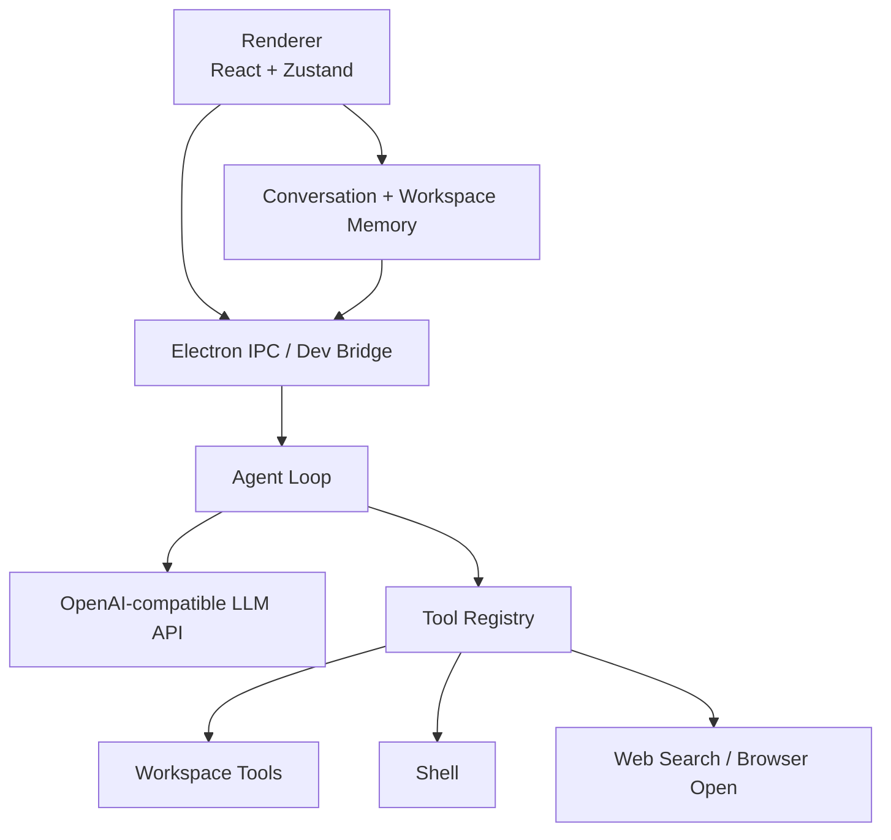

<p align="center">
  
</p>

<h1 align="center">Nexa</h1>

<p align="center">
  A desktop coding agent that connects models, tools, local workspaces, and long-running software tasks.
</p>

<p align="center">
  <a href="README.zh-CN.md">中文</a> ·
  <a href="docs/README.md">Docs</a> ·
  <a href="CONTRIBUTING.md">Contributing</a>
</p>

## Overview

Nexa is an Electron + React desktop agent for real software work. It brings together OpenAI-compatible model APIs, local CLI agents, workspace-aware context, tool calls, streaming output, task queues, and Markdown-rich responses in one focused interface.

The goal is not to build another plain chat wrapper. Nexa owns the agent loop: it lets the model plan, call tools, observe results, recover from long tasks, and produce final answers grounded in local workspace state.

## Features

- Workspace-first conversations with one or more chats under each local directory.
- OpenAI-compatible model configuration, including DeepSeek, OpenAI, MiniMax, Qwen, Kimi, Groq, OpenRouter, Ollama, and other compatible endpoints.
- Codex-style agent loop with tool calls, observations, context compaction, retry/recovery, and resumable task state.
- Built-in tools for workspace file listing, search, file read/write, patch application, shell execution, web search/open/research, browser rendering, weather, planning, and context compaction.
- Streaming UI with task queue support.
- Markdown rendering with code highlighting, tables, copy buttons, and Mermaid diagrams.
- Local-first storage for workspaces, conversations, transcripts, memory, and model settings.
- Desktop packaging scripts for macOS, Windows, and Linux.

## Architecture



## Project Structure

```text
Nexa/
├── config/                 # Vite and TypeScript config
├── docs/                   # Architecture and design notes
├── resources/              # App icons and static resources
├── scripts/                # Build, dev, packaging, reference sync
├── src/
│   ├── main/
│   │   ├── agent-core/     # Agent loop, tools, context builder
│   │   ├── agent-runtime/  # CLI adapter runtime
│   │   ├── ipc-handlers.ts
│   │   ├── llm-api.ts
│   │   └── preload.ts
│   ├── renderer/
│   │   ├── components/     # Chat, settings, workspace UI
│   │   └── stores/         # Zustand app state and memory
│   └── shared/             # Shared types and IPC channels
└── package.json
```

## Requirements

- Node.js 22+
- npm
- An OpenAI-compatible API key for the built-in LLM path
- Optional local CLI agents such as Claude Code, Codex CLI, Hermes, Kimi, Kiro, or OpenCode

## Getting Started

Install dependencies:

```bash
npm install
```

Run the Electron app in development:

```bash
npm run dev
```

Run the browser-only development bridge:

```bash
npm run dev:bridge
npm run dev:renderer
```

Open:

```text
http://localhost:5173/
```

## Build And Package

Build both main and renderer processes:

```bash
npm run build
```

Package for the current platform:

```bash
npm run pack
```

Platform-specific packaging:

```bash
npm run pack:mac
npm run pack:win
npm run pack:linux
```

## Model Configuration

Open Settings in the app and add an OpenAI-compatible model provider. API keys are stored locally by the desktop app. Do not commit secrets to the repository.

Example DeepSeek-compatible configuration:

```text
Name: DeepSeek
Base URL: https://api.deepseek.com
Model: deepseek-chat
```

## Documentation

- [Documentation index](docs/README.md)
- [Agent loop architecture](docs/agent-loop-architecture.md)
- [Context management design](docs/context-management-design.md)
- [Workspace and conversation design](docs/workspace-conversation-context-design.md)
- [Streaming UI issue analysis](docs/agent-streaming-ui-issues.md)

## Repository Hygiene

Generated files, local caches, packaged apps, API keys, and runtime state should not be committed. See [.gitignore](.gitignore) and [CONTRIBUTING.md](CONTRIBUTING.md).

## License

ISC
