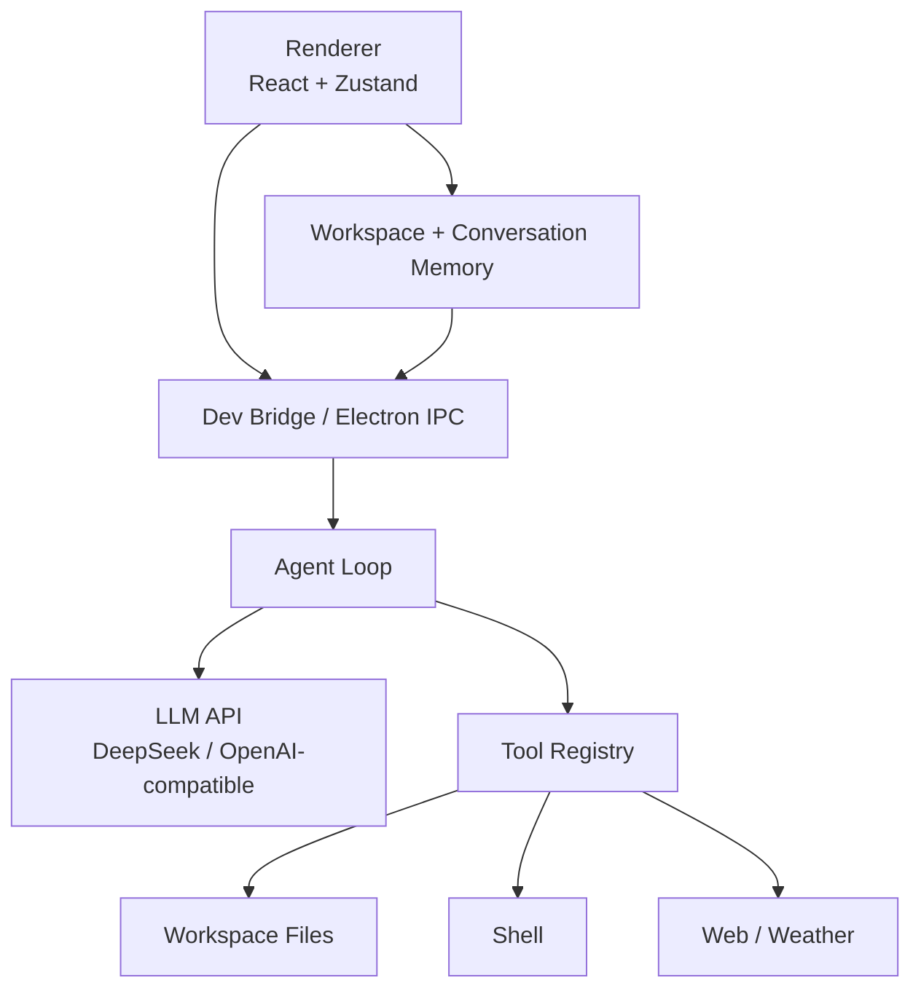

<p align="center">
  
</p>

<h1 align="center">PigAgent</h1>

<p align="center">
  A desktop coding agent for long-running software work, workspace-aware conversations, and tool-driven development.
</p>

<p align="center">
  <a href="README.zh-CN.md">中文</a> · <a href="docs/context-management-design.md">Context Design</a> · <a href="docs/workspace-conversation-context-design.md">Workspace Design</a>
</p>

## Overview

PigAgent is an Electron + React desktop application that wraps coding agents and large-model APIs behind a focused chat interface. It is designed for real project work: each workspace has its own conversations, memory, transcripts, tool history, and artifacts.

The project currently supports OpenAI-compatible LLM APIs such as DeepSeek, local CLI-agent bridges, streaming assistant output, tool calls, workspace-aware context, Markdown rendering, Mermaid diagrams, and queued follow-up tasks.

## Highlights

- **Workspace-first UX**: add local directories as workspaces and create multiple conversations under each workspace.
- **Context-aware conversations**: workspace memory and conversation memory are injected into each agent request.
- **Agent loop**: model planning, tool calling, tool observation, post-tool summarization, and final streaming output.
- **Tool system**: workspace file listing, search, file read/write, patch application, shell execution, web fetch, and weather lookup.
- **Streaming UI**: final answers render incrementally with a typewriter-like experience.
- **Task queue**: when a task is running, new prompts are queued instead of interrupting the current run.
- **Markdown-rich output**: code highlighting, light code blocks, copy buttons, tables, and Mermaid diagram rendering.
- **Failure-aware flow**: successful tool results are preserved even if the final model summary times out.
- **Packaging scripts**: build and package scripts for desktop distribution.

## Architecture



## Workspace And Context Model

PigAgent separates context into three layers:

- **Transcript**: the full message history used for UI restore and debugging.
- **Conversation memory**: short-term task memory, including summaries, touched files, artifacts, and recent tool results.
- **Workspace memory**: project-level memory shared by conversations in the same workspace.

Each request is built by the Context Builder:

```text
system prompt
workspace memory
conversation memory
recent messages
current user prompt
```

This keeps long-running conversations useful without blindly sending every old tool result back to the model.

## Project Structure

```text
PigAgent/
├── src/
│   ├── main/
│   │   ├── agent-core/          # Agent loop, tools, context builder
│   │   ├── agent-runtime/       # CLI agent runtime adapters
│   │   ├── dev-bridge.ts        # HTTP/SSE bridge for browser dev mode
│   │   ├── ipc-handlers.ts      # Electron IPC handlers
│   │   └── llm-api.ts           # OpenAI-compatible LLM API integration
│   ├── renderer/
│   │   ├── components/          # Chat, workspace sidebar, settings
│   │   └── stores/app-store.ts  # Zustand state, queue, memory, transcript
│   └── shared/                  # Shared types and IPC channels
├── docs/                        # Architecture and design docs
├── resources/                   # App icon and static resources
├── scripts/                     # Packaging and utility scripts
└── config/                      # Vite, TypeScript, Tailwind config
```

## Getting Started

### Requirements

- Node.js 22 or newer
- npm
- A DeepSeek or OpenAI-compatible API key for the built-in LLM path
- Optional CLI agents such as Claude Code, Codex CLI, Hermes, Kimi, or Kiro

### Install

```bash
npm install
```

### Run In Browser Dev Mode

Start the bridge:

```bash
npm run dev:bridge
```

Start Vite:

```bash
npm run dev:renderer
```

Open:

```text
http://localhost:5173/
```

### Run Electron

```bash
npm start
```

### Package

```bash
npm run pack
```

Platform-specific scripts are also available:

```bash
npm run pack:mac
npm run pack:win
npm run pack:linux
```

## Configuration

PigAgent includes a default DeepSeek-compatible model configuration. The API key can be loaded from an environment file or entered in settings.

Typical configuration:

```text
Provider: DeepSeek
Base URL: https://api.deepseek.com
Model: deepseek-chat
Env Var: DEEPSEEK_API_KEY
```

Do not commit API keys. Keep secrets in local `.env` files or system environment variables.

## Documentation

- [Agent loop architecture](docs/agent-loop-architecture.md)
- [Context management design](docs/context-management-design.md)
- [Workspace and conversation context design](docs/workspace-conversation-context-design.md)
- [Streaming UI issue analysis](docs/agent-streaming-ui-issues.md)

## Status

PigAgent is under active development. Core agent-loop, workspace context, model configuration, streaming UI, and Markdown rendering are implemented, while native directory picking, richer compaction, conversation deletion, and production hardening are still evolving.

## License

ISC
