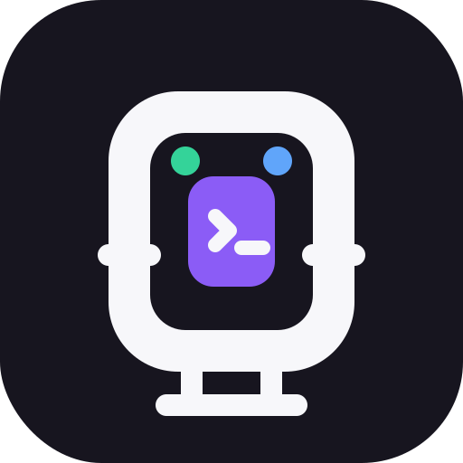
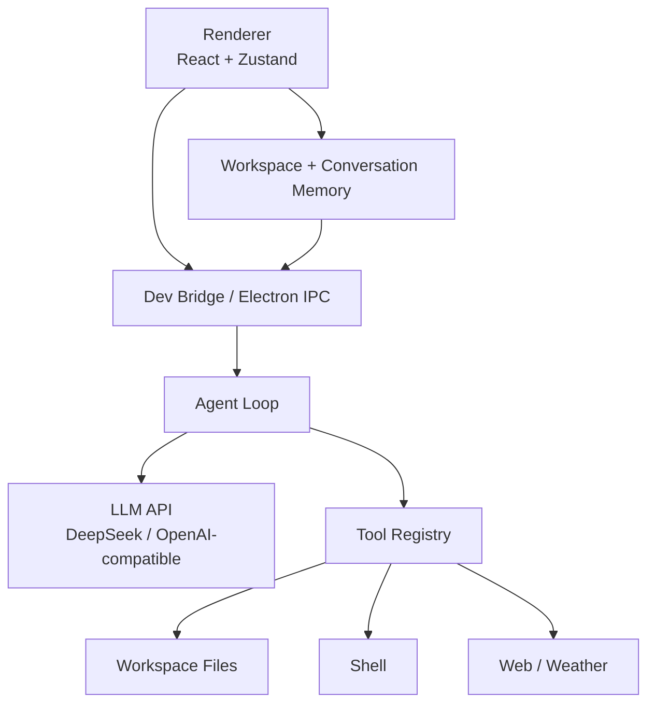

<p align="center">
  
</p>

<h1 align="center">PigAgent</h1>

<p align="center">
  面向长期软件开发任务的桌面 Agent：支持工作区、多对话、上下文记忆、工具调用和流式输出。
</p>

<p align="center">
  <a href="README.md">English</a> · <a href="docs/context-management-design.md">上下文设计</a> · <a href="docs/workspace-conversation-context-design.md">工作区设计</a>
</p>

## 项目简介

PigAgent 是一个基于 Electron + React 的桌面编程 Agent 应用。它把大模型 API、CLI Agent、工具调用和工作区上下文管理整合到一个聚焦的聊天界面中，用于真实项目里的代码阅读、文档生成、文件修改、命令执行和多轮开发任务。

PigAgent 当前支持 OpenAI-compatible API，例如 DeepSeek，也支持开发模式下的本地 bridge、流式回复、工具调用、工作区上下文、Markdown 渲染、Mermaid 图、任务队列和多对话管理。

## 核心特性

- **工作区优先**：用户可以添加本地目录作为 Workspace，并在每个 Workspace 下创建多个 Conversation。
- **上下文记忆**：每次请求都会注入 workspace memory、conversation memory 和 recent messages。
- **Agent Loop**：支持模型规划、工具调用、工具结果观察、工具后总结和最终流式输出。
- **工具系统**：支持文件列表、代码搜索、批量读文件、写文件、应用 patch、执行 shell、网页抓取和天气查询。
- **流式 UI**：最终回答可以像打字机一样逐步显示。
- **任务队列**：任务运行中继续发送消息时，默认加入队列，不打断当前任务。
- **富 Markdown 输出**：支持亮色代码高亮、复制按钮、表格和 Mermaid 图渲染。
- **可靠失败处理**：工具已经成功时，即使最终模型总结超时，也会保留并展示已完成的工具结果。
- **桌面打包**：提供跨平台打包脚本。

## 架构概览



## Workspace 与 Context 模型

PigAgent 将上下文拆成三层：

- **Transcript**：完整消息记录，用于 UI 恢复、调试和后续 resume/fork。
- **Conversation Memory**：当前对话的短期任务记忆，包括摘要、触碰过的文件、产物和工具摘要。
- **Workspace Memory**：当前项目目录的长期记忆，可被同一工作区下的多个对话共享。

每次请求都会由 Context Builder 组装：

```text
system prompt
workspace memory
conversation memory
recent messages
current user prompt
```

这样可以让模型理解“刚才那个文件”“继续上一步”等引用，同时避免把所有历史工具结果无限塞入上下文。

## 项目结构

```text
PigAgent/
├── src/
│   ├── main/
│   │   ├── agent-core/          # Agent loop、工具、context builder
│   │   ├── agent-runtime/       # CLI agent runtime adapters
│   │   ├── dev-bridge.ts        # 浏览器开发模式 HTTP/SSE bridge
│   │   ├── ipc-handlers.ts      # Electron IPC handlers
│   │   └── llm-api.ts           # OpenAI-compatible LLM API 集成
│   ├── renderer/
│   │   ├── components/          # Chat、workspace sidebar、settings
│   │   └── stores/app-store.ts  # Zustand 状态、队列、memory、transcript
│   └── shared/                  # 共享类型和 IPC 通道
├── docs/                        # 架构和设计文档
├── resources/                   # 图标和静态资源
├── scripts/                     # 打包和工具脚本
└── config/                      # Vite、TypeScript、Tailwind 配置
```

## 快速开始

### 环境要求

- Node.js 22 或更高版本
- npm
- DeepSeek 或 OpenAI-compatible API key
- 可选：Claude Code、Codex CLI、Hermes、Kimi、Kiro 等 CLI Agent

### 安装依赖

```bash
npm install
```

### 浏览器开发模式

启动 bridge：

```bash
npm run dev:bridge
```

启动 Vite：

```bash
npm run dev:renderer
```

打开：

```text
http://localhost:5173/
```

### Electron 运行

```bash
npm start
```

### 打包

```bash
npm run pack
```

也可以使用平台脚本：

```bash
npm run pack:mac
npm run pack:win
npm run pack:linux
```

## 模型配置

PigAgent 默认内置 DeepSeek-compatible 配置。API key 可以从环境文件读取，也可以在设置界面填写。

典型配置：

```text
Provider: DeepSeek
Base URL: https://api.deepseek.com
Model: deepseek-chat
Env Var: DEEPSEEK_API_KEY
```

不要提交 API key。请将密钥保存在本地 `.env` 文件或系统环境变量中。

## 文档

- [Agent Loop 架构](docs/agent-loop-architecture.md)
- [Context 管理设计](docs/context-management-design.md)
- [Workspace 与 Conversation Context 设计](docs/workspace-conversation-context-design.md)
- [流式 UI 问题复盘](docs/agent-streaming-ui-issues.md)

## 当前状态

PigAgent 仍在积极开发中。核心 agent loop、workspace context、模型配置、流式 UI 和 Markdown 渲染已经实现；原生目录选择器、更强的 compaction、对话删除和生产级稳定性仍在迭代。

## License

ISC
