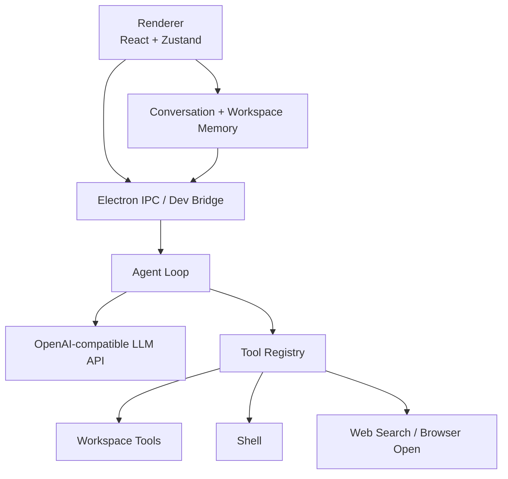

<p align="center">
  
</p>

<h1 align="center">Nexa</h1>

<p align="center">
  连接模型、工具、本地工作区和长期软件任务的桌面编程 Agent。
</p>

<p align="center">
  <a href="README.md">English</a> ·
  <a href="docs/README.md">文档</a> ·
  <a href="CONTRIBUTING.md">贡献指南</a>
</p>

## 项目简介

Nexa 是一个基于 Electron + React 的桌面编程 Agent。它把 OpenAI-compatible 模型 API、本地 CLI Agent、工作区上下文、工具调用、流式输出、任务队列和 Markdown 富文本回复整合到一个聚焦的界面里。

Nexa 不是普通聊天壳。它自己负责 agent loop：让模型规划、调用工具、观察结果、处理长任务恢复，并基于本地工作区状态给出最终回复。

## 核心能力

- 以 Workspace 为中心：每个本地目录下可以创建多个对话。
- 支持 OpenAI-compatible 模型配置，包括 DeepSeek、OpenAI、MiniMax、Qwen、Kimi、Groq、OpenRouter、Ollama 等兼容端点。
- Codex 风格 agent loop：工具调用、观察结果、上下文压缩、恢复重试、任务状态管理。
- 内置工具：工作区文件列表、代码搜索、文件读写、patch、shell、网页搜索/打开/research、浏览器渲染、天气、计划更新、上下文压缩。
- 流式 UI 和任务队列。
- Markdown 渲染：代码高亮、表格、复制按钮、Mermaid 图。
- 本地优先存储：工作区、对话、transcript、memory、模型设置都保存在本机。
- macOS、Windows、Linux 打包脚本。

## 架构概览



## 目录结构

```text
Nexa/
├── config/                 # Vite 和 TypeScript 配置
├── docs/                   # 架构和设计文档
├── resources/              # 图标和静态资源
├── scripts/                # 开发、构建、打包、参考同步脚本
├── src/
│   ├── main/
│   │   ├── agent-core/     # Agent loop、工具、context builder
│   │   ├── agent-runtime/  # CLI agent runtime adapters
│   │   ├── ipc-handlers.ts
│   │   ├── llm-api.ts
│   │   └── preload.ts
│   ├── renderer/
│   │   ├── components/     # Chat、settings、workspace UI
│   │   └── stores/         # Zustand 状态和 memory
│   └── shared/             # 共享类型和 IPC 通道
└── package.json
```

## 环境要求

- Node.js 22+
- npm
- 一个 OpenAI-compatible API key
- 可选本地 CLI Agent：Claude Code、Codex CLI、Hermes、Kimi、Kiro、OpenCode 等

## 快速开始

安装依赖：

```bash
npm install
```

启动 Electron 开发模式：

```bash
npm run dev
```

启动浏览器开发模式：

```bash
npm run dev:bridge
npm run dev:renderer
```

打开：

```text
http://localhost:5173/
```

## 构建和打包

构建主进程和渲染进程：

```bash
npm run build
```

打包当前平台：

```bash
npm run pack
```

平台打包：

```bash
npm run pack:mac
npm run pack:win
npm run pack:linux
```

## 模型配置

在应用设置中添加 OpenAI-compatible 模型。API key 保存在本机，请不要提交到仓库。

DeepSeek 示例：

```text
Name: DeepSeek
Base URL: https://api.deepseek.com
Model: deepseek-chat
```

## 文档

- [文档目录](docs/README.md)
- [Agent Loop 架构](docs/agent-loop-architecture.md)
- [Context 管理设计](docs/context-management-design.md)
- [Workspace 与 Conversation 设计](docs/workspace-conversation-context-design.md)
- [流式 UI 问题复盘](docs/agent-streaming-ui-issues.md)

## 仓库卫生

生成文件、本地缓存、打包产物、API key、运行时状态不应提交。请查看 [.gitignore](.gitignore) 和 [CONTRIBUTING.md](CONTRIBUTING.md)。

## License

ISC
