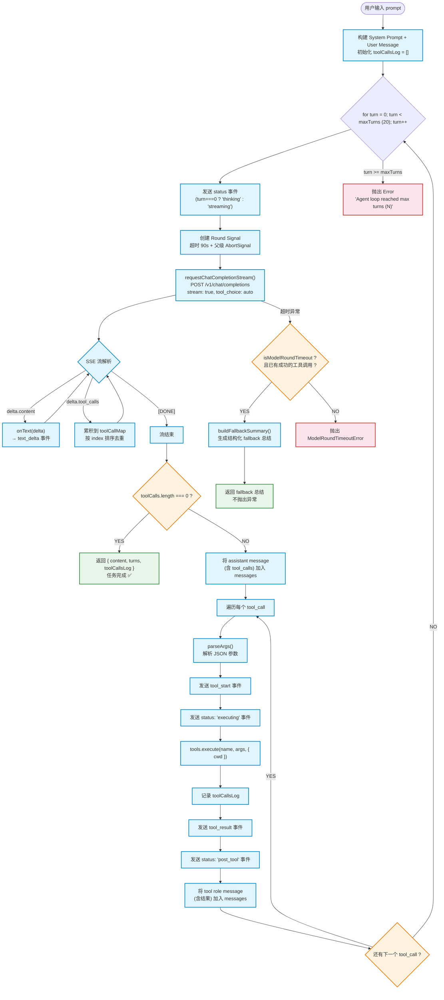
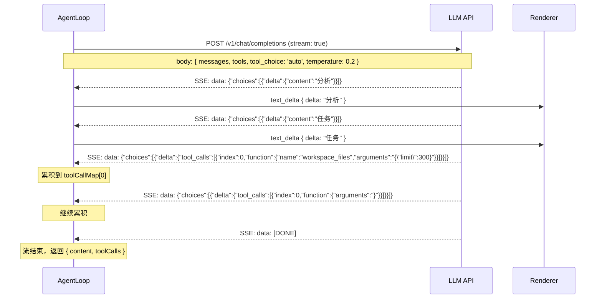
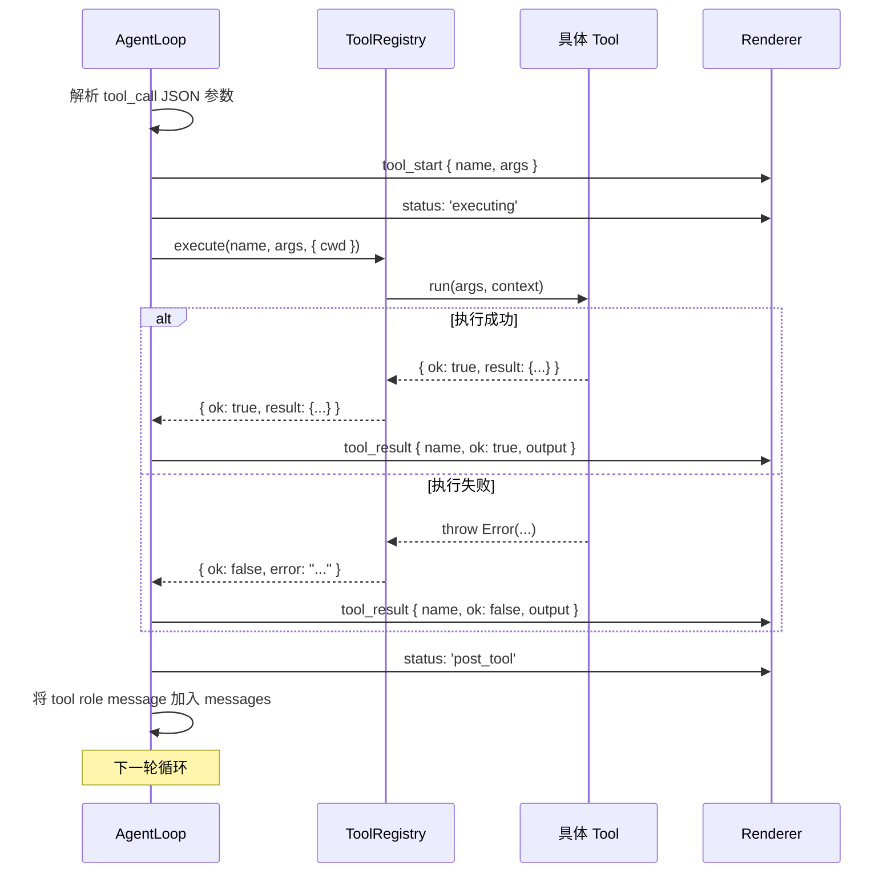
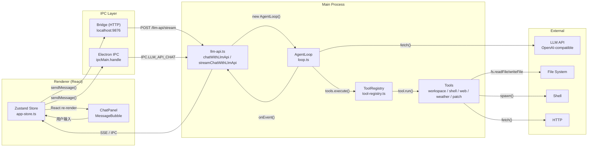
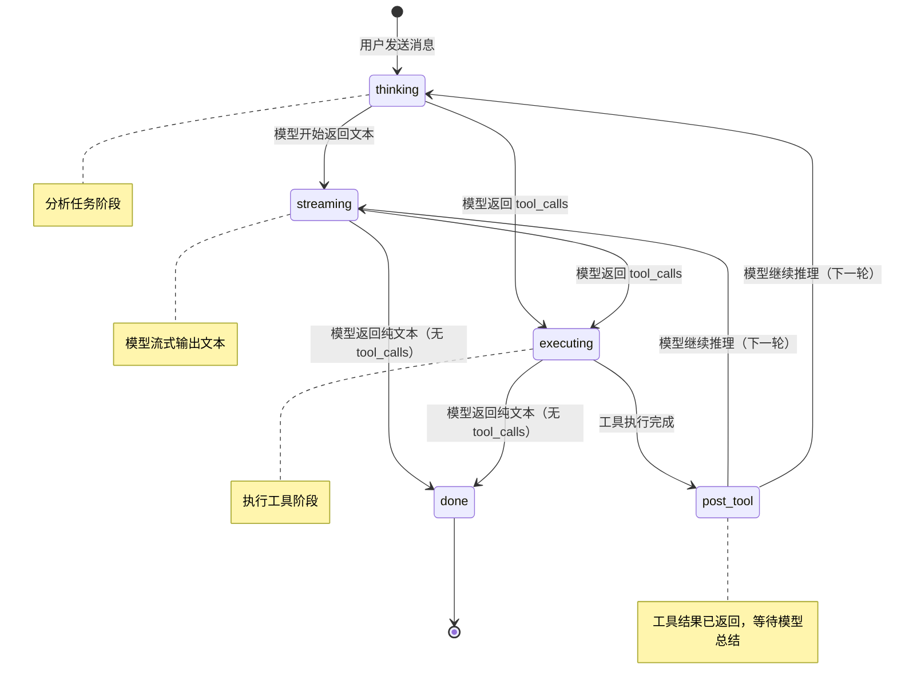
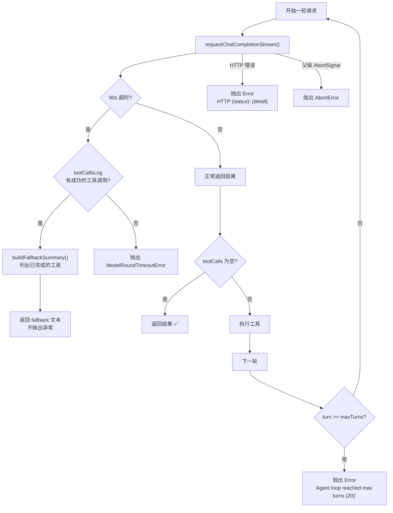
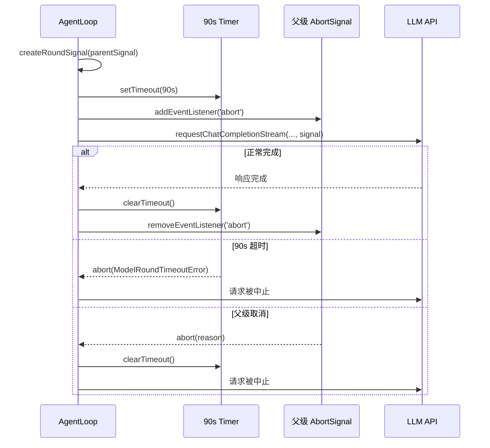
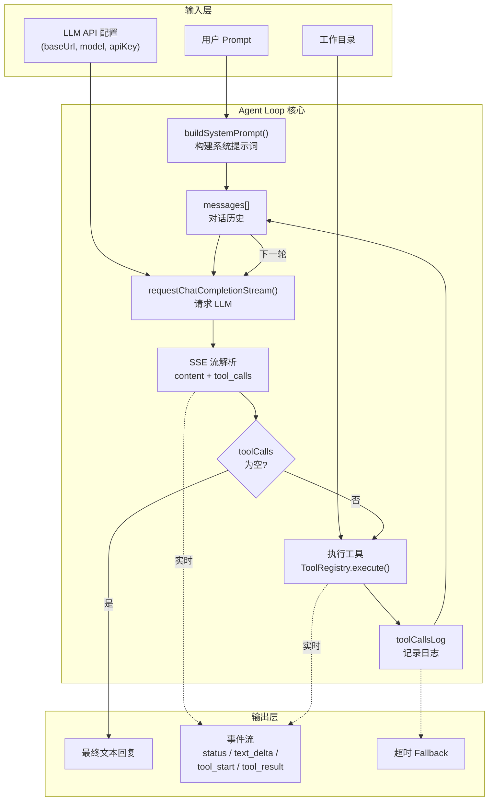
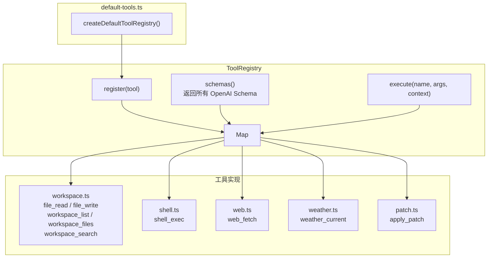

# Agent Loop 流程图

> 使用 Mermaid 语法绘制，可在支持 Mermaid 的 Markdown 渲染器中查看。

---

## 1. 主循环流程图



---

## 2. 流式 SSE 解析流程



---

## 3. 工具执行流程



---

## 4. 完整调用链路



---

## 5. 状态机



---

## 6. 超时与错误处理流程



---

## 7. Round Signal 生命周期



---

## 8. 数据流图



---

## 9. 工具注册架构



---

## 10. 时序总览

```mermaid
sequenceDiagram
    participant User as 用户
    participant UI as Renderer UI
    participant Store as Zustand Store
    participant IPC as IPC/Bridge
    participant Loop as AgentLoop
    participant Tools as ToolRegistry
    participant LLM as LLM API

    User->>UI: 输入 prompt
    UI->>Store: sendMessage()
    Store->>IPC: chatLlmApi(config, prompt, cwd)

    Note over Loop: === 第 1 轮 ===
    IPC->>Loop: run({ config, apiKey, prompt, cwd, onEvent })
    Loop->>LLM: POST /v1/chat/completions (stream: true)
    LLM-->>Loop: SSE: text_delta (思考过程)
    Loop-->>IPC: onEvent(text_delta)
    IPC-->>Store: 更新消息
    Store-->>UI: 实时渲染

    LLM-->>Loop: SSE: tool_calls [workspace_files]
    Loop->>Tools: execute("workspace_files", { limit: 300 }, { cwd })
    Tools-->>Loop: { ok: true, result: [...] }
    Loop-->>IPC: onEvent(tool_result)
    IPC-->>Store: 更新消息

    Note over Loop: === 第 2 轮 ===
    Loop->>LLM: POST (含工具结果)
    LLM-->>Loop: SSE: text_delta (分析文件列表)
    LLM-->>Loop: SSE: tool_calls [file_read_many]
    Loop->>Tools: execute("file_read_many", { paths: [...] }, { cwd })
    Tools-->>Loop: { ok: true, result: { files: [...] } }
    Loop-->>IPC: onEvent(tool_result)

    Note over Loop: === 第 3 轮 ===
    Loop->>LLM: POST (含文件内容)
    LLM-->>Loop: SSE: text_delta (最终回答)
    LLM-->>Loop: SSE: [DONE] (无 tool_calls)
    Loop-->>IPC: onEvent(final)
    IPC-->>Store: 完成
    Store-->>UI: 显示最终回复
    UI-->>User: 展示结果
```
