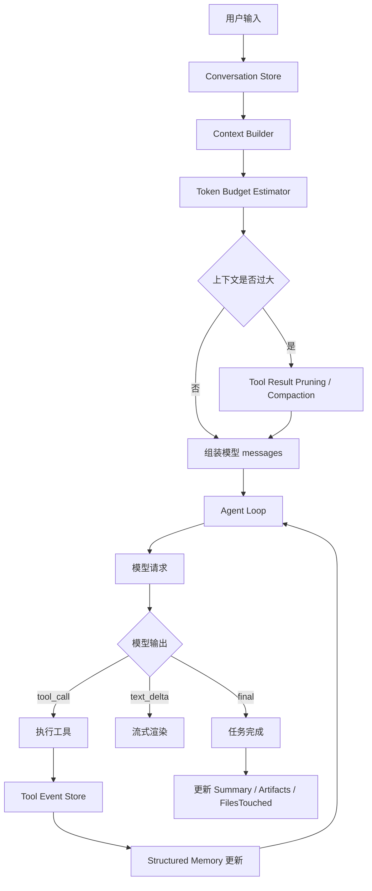
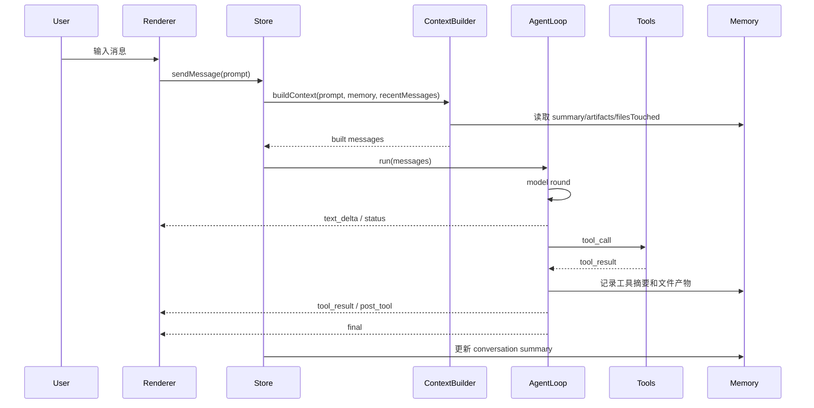

# PigAgent Context 管理设计文档

本文档用于梳理 Codex、Claude/Claude Code 在上下文管理上的设计思路，并基于 PigAgent 当前实现提出一套可落地的 context 管理方案。

## 1. 背景

Agent 类应用和普通聊天应用最大的区别是：

1. Agent 会执行工具。
2. 工具结果可能非常大，例如文件内容、搜索结果、命令输出。
3. Agent 任务可能持续很多轮。
4. 用户会跨多轮引用之前的任务，例如“刚才那个文档”“继续完善上一步”。
5. 长上下文会增加成本、延迟，并降低模型质量。

因此 context 管理不能简单等同于“把所有聊天历史都发给模型”。

PigAgent 需要同时解决：

- 单次 agent loop 内部的上下文连续性。
- 多轮对话之间的记忆。
- 工具结果的膨胀。
- 长任务超时和恢复。
- 文档、补丁、文件写入等产物的结构化记录。

## 2. Codex 的 Context 设计

### 2.1 核心思路

Codex 的设计更偏向 **客户端 session transcript + 每轮重新组装上下文**。

公开资料显示，Codex CLI 会把会话 transcript 存在本地，用户可以 resume 之前的会话，避免重复提供上下文。OpenAI Codex CLI 文档说明 Codex 会在本地保存 transcripts，用于恢复之前的对话：

- https://developers.openai.com/codex/cli/features

GitHub discussion 中也有关于 Codex session 的描述：Codex 的持久 session state 主要在客户端本地，`~/.codex/sessions/...` 包含完整 transcript；resume/fork/compact 都基于本地记录，而不是依赖服务端永久保存模型状态：

- https://github.com/openai/codex/discussions/8339

这说明 Codex 的 context 可以理解为：

```text
本地 transcript 是事实来源
        ↓
每次请求前由客户端选择相关历史
        ↓
重新组装 prompt
        ↓
模型继续推理
        ↓
工具调用和结果追加回 transcript
```

### 2.2 Codex 的 Session 模型

Codex 的 session 通常包含：

- 用户输入。
- assistant 输出。
- 工具调用。
- 工具结果。
- 当前工作目录和相关配置。
- compact 后的摘要。

这类 session 不是模型内部状态的“冻结恢复”，而是通过 transcript 重建上下文。

也就是说，resume 的本质不是：

```text
恢复模型脑子里的状态
```

而是：

```text
读取历史 transcript → 重新喂给模型 → 让模型继续
```

### 2.3 Codex 的队列与长任务

Codex CLI 支持运行中 queue follow-up text。也就是当前任务还在执行时，用户可以输入后续内容，等当前任务结束后继续处理。

这种设计避免了一个 session 内多个 agent loop 并发执行造成上下文混乱。

推荐原则是：

```text
同一会话内单 agent loop 串行执行
运行中输入进入队列
当前 loop 结束后再执行下一条
```

这和 PigAgent 目前正在采用的队列策略一致。

### 2.4 Codex 的 Compaction 问题

Codex 也会遇到 compact 相关问题。公开 issue/discussion 中有用户反馈：

- compact 后丢失任务意图。
- compact 后重新执行已完成任务。
- 本地 JSONL session 过大，包含图片/base64 payload，导致 compact 或 resume 出问题。
- 自动 compact 时机不透明。

相关资料：

- https://github.com/openai/codex/issues/10823
- https://github.com/openai/codex/issues/11325
- https://github.com/openai/codex/discussions/5799

这些问题说明：

1. 只保存 transcript 不够。
2. compact 摘要如果质量不好，会丢关键状态。
3. 工具结果、图片、文件内容不能无限进入 transcript。
4. 需要结构化记录“已完成事项”“修改文件”“当前目标”。

## 3. Claude / Claude Code 的 Context 设计

### 3.1 Context Window 是工作记忆

Claude Code 文档明确说明，context window 包含 Claude 当前 session 中知道的一切：

- 用户指令。
- Claude 自己的回复。
- 读取过的文件。
- 工具结果。
- 终端里不可见但已经进入上下文的内容。

来源：

- https://code.claude.com/docs/en/context-window

这说明 Claude Code 的上下文模型更偏：

```text
当前 context window = Claude 的短期工作记忆
```

### 3.2 CLAUDE.md 与 Auto Memory

Claude Code 有两个互补的 memory 系统：

1. `CLAUDE.md`
2. Auto memory

官方文档说明这些 memory 会在每次 conversation 开始时加载，但它们只是 context，不是强制配置。若要强制阻止某些行为，需要 hook，例如 `PreToolUse`。

来源：

- https://code.claude.com/docs/en/memory

这点非常关键：

```text
Memory 是提示，不是安全边界
```

对 PigAgent 的启发是：

- 项目级规则可以放入 `PIGAGENT.md` 或 `.pigagent/memory.md`。
- 但敏感操作、路径越界、危险命令必须靠代码层约束，不能只靠提示词。

### 3.3 Compaction

Anthropic 官方 compaction 文档说明，compaction 用于长对话和 agentic workflows，当接近 context window 限制时，把旧上下文总结成更短摘要，从而延长有效上下文长度。

来源：

- https://platform.claude.com/docs/en/build-with-claude/compaction

Claude Code 的 `/compact` 本质是：

```text
把旧 conversation history 替换成结构化摘要
保留当前任务所需状态
继续后续任务
```

它解决的是：

- 上下文过大。
- 延迟和成本过高。
- 模型质量随上下文膨胀下降。

但它也会带来问题：

- 摘要遗漏关键文件。
- 摘要遗漏用户约束。
- 摘要后模型重新做已完成工作。
- 某些 scoped rule 或嵌套 memory 需要再次读取才恢复。

### 3.4 Context Editing

Anthropic 还提供 context editing。官方文档说明，旧 tool results，尤其是文件内容和搜索结果，在 Claude 已经处理后通常不再需要，可以从上下文中清除。

来源：

- https://platform.claude.com/docs/en/build-with-claude/context-editing

这对 agent 应用非常重要，因为工具结果通常是上下文膨胀的主要来源。

典型策略：

```text
最近工具结果：保留全文
旧文件内容：清除全文，只保留摘要
旧搜索结果：清除全文，只保留命中路径和结论
旧 thinking：清理或压缩
```

### 3.5 Claude 的问题

Claude 的 context 设计强大，但仍有典型问题：

1. 长上下文质量下降。
2. compact 可能丢失关键细节。
3. memory 是提示，不是约束。
4. 工具结果过大时，模型注意力被噪音占据。
5. 用户以为 Claude “记得”，但 compact 或 clear 后其实可能忘了。

Claude 的解决方向是：

- 明确区分 short-term context 和 persistent memory。
- 用 compaction 压缩历史。
- 用 context editing 清理旧工具结果。
- 用 hooks 处理必须强制执行的规则。
- 用 subagent 隔离大型读取任务，避免主上下文被污染。

## 4. PigAgent 当前 Context 现状

### 4.1 当前实现

PigAgent 当前 `AgentLoop.run()` 每次会新建 messages：

```ts
const messages = [
  { role: 'system', content: buildSystemPrompt() },
  { role: 'user', content: options.prompt },
];
```

这意味着：

```text
每次用户发起任务，只带当前 prompt 和 system prompt
```

在同一个 agent loop 内，会继续追加：

- assistant tool_calls
- tool results
- assistant final answer

所以：

```text
单次任务内部有上下文
多轮任务之间没有真实上下文
```

### 4.2 当前问题

#### 4.2.1 多轮对话不理解“刚才”

例如用户说：

```text
把刚才那个文档再加一个时序图
```

当前模型未必知道“刚才那个文档”是什么，除非它重新读工作区。

#### 4.2.2 工具结果在单轮内膨胀

复杂任务中会出现：

```text
workspace_list
file_read
file_read
file_read
...
```

每个工具结果都会进入当前 loop 的 messages，导致上下文快速膨胀。

#### 4.2.3 文档/文件产物没有结构化记忆

虽然 `file_write` 成功写了文档，但当前系统没有统一记录：

```ts
artifacts: [
  { path: 'docs/xxx.md', type: 'doc', summary: '...' }
]
```

因此后续引用时不可靠。

#### 4.2.4 超时处理曾覆盖已完成工具结果

之前出现过：

```text
file_write result
Error: Request timed out
```

问题是：文件已经写入成功，但最终总结模型请求超时，UI 却只展示错误。

已改进为 fallback summary：

```text
模型最终总结响应超时，但以下工具操作已经完成：
- file_write：created docs/xxx.md
```

#### 4.2.5 UI 消息顺序与事件顺序冲突

流式输出后，可能先收到 `text_delta`，后收到 `tool_start`，导致文本显示在工具过程上方。

已通过 UI 排序修复：

```text
thinking/tool_use/tool_result 在上
text 在下
```

## 5. PigAgent Context 设计目标

PigAgent 应采用 Codex 和 Claude 的混合方案：

```text
Codex 的客户端 transcript/session
+ Claude 的 memory/compaction/context editing
+ PigAgent 自己的 structured memory
```

目标：

1. 多轮任务能理解“刚才”。
2. 长任务不会因为上下文膨胀变慢或超时。
3. 工具结果不会无限塞进模型上下文。
4. 文件产物、修改路径、决策被结构化记录。
5. compact 后仍能继续任务。
6. 工具成功结果不会被后续模型失败覆盖。

## 6. PigAgent 推荐架构



## 7. 核心模块设计

### 7.1 Conversation Transcript

保存完整原始记录，用于 UI、恢复和 debug。

```ts
interface ConversationTranscript {
  id: string;
  workspaceId: string;
  messages: ChatMessage[];
  events: AgentEvent[];
  createdAt: number;
  updatedAt: number;
}
```

注意：

- transcript 是事实记录。
- 不代表每次都全量发给模型。
- 可用于 resume/fork/debug。

### 7.2 Structured Memory

保存模型需要长期记住的结构化事实。

```ts
interface AgentMemory {
  projectSummary?: string;
  conversationSummary?: string;
  activeGoal?: string;
  decisions: DecisionRecord[];
  filesTouched: FileTouchRecord[];
  artifacts: ArtifactRecord[];
  toolSummaries: ToolResultSummary[];
}

interface ArtifactRecord {
  path: string;
  type: 'doc' | 'patch' | 'report' | 'code' | 'other';
  summary: string;
  createdAt: number;
  sourceTaskId: string;
}

interface FileTouchRecord {
  path: string;
  action: 'read' | 'write' | 'patch' | 'delete';
  summary?: string;
  timestamp: number;
}
```

作用：

- 用户说“刚才那个文档”时，从 `artifacts` 找。
- 用户说“继续上次修改”时，从 `filesTouched` 找。
- compact 后用结构化 memory 恢复关键状态。

### 7.3 Context Builder

每次请求前动态组装模型上下文。

输入：

```ts
interface ContextBuildInput {
  systemPrompt: string;
  currentPrompt: string;
  recentMessages: ChatMessage[];
  memory: AgentMemory;
  cwd: string;
}
```

输出：

```ts
interface BuiltContext {
  messages: ChatMessageWire[];
  estimatedTokens: number;
  includedSections: string[];
}
```

组装顺序：

```text
system prompt
project memory
conversation summary
recent messages
relevant artifacts/files
current user prompt
```

不要默认把所有历史消息和工具结果塞进去。

### 7.4 Tool Result Pruning

工具结果按类型处理。

#### file_read / file_read_many

保留：

- 文件路径
- 文件摘要
- 关键符号
- 是否被用于本轮任务

不长期保留：

- 大段文件全文

#### workspace_search

保留：

- pattern
- 命中文件列表
- 关键命中行

不长期保留：

- 全部搜索输出

#### shell_exec

保留：

- command
- exit code
- 关键输出摘要

不长期保留：

- 全量日志

#### file_write / apply_patch

保留：

- path
- action
- 摘要
- 是否成功

这类结果非常重要，因为它们是用户后续引用“刚才写的文件”的主要依据。

### 7.5 Compaction

当上下文超过阈值时触发 compact。

推荐策略：

```text
0% - 60%：正常保留最近上下文
60% - 80%：清理旧 tool result 全文
80% - 90%：生成 conversation summary
90%+：强制 compact 或拒绝继续塞入大内容
```

Compact 产物应包含：

```ts
interface CompactionResult {
  summary: string;
  activeGoal?: string;
  completedSteps: string[];
  pendingSteps: string[];
  filesTouched: string[];
  artifacts: ArtifactRecord[];
  openQuestions: string[];
}
```

### 7.6 Context Budget Estimator

初期可以用字符估算：

```ts
estimatedTokens = Math.ceil(text.length / 4)
```

后续可以接入 tokenizer。

Budget 不只用于防止超上下文，还用于提升质量：

```text
上下文越大，模型越慢、越贵、越容易忽略关键内容
```

## 8. PigAgent 执行逻辑

### 8.1 用户发送消息

```text
用户输入
  ↓
如果当前有任务运行，进入队列
  ↓
如果空闲，启动 startTask
```

### 8.2 构建上下文

```text
读取 conversation transcript
读取 structured memory
选取 recent messages
选取 relevant artifacts
估算 token
必要时 compact/prune
组装 messages
```

### 8.3 Agent Loop 内部

```text
模型请求
  ↓
text_delta → UI 流式显示
tool_call → 执行工具
tool_result → 记录事件和 memory
post_tool → 显示正在整理最终回复
final → 任务完成
```

### 8.4 任务结束

任务结束后更新：

- transcript
- conversationSummary
- filesTouched
- artifacts
- toolSummaries
- activeGoal 状态

## 9. PigAgent 需要解决的问题与方案

### 9.1 问题：多轮对话没有记忆

方案：

- 增加 `ConversationTranscript`
- 增加 `AgentMemory`
- 请求时传入 recent messages + summary + artifacts

### 9.2 问题：工具结果膨胀

方案：

- 最近工具结果保留全文
- 旧工具结果转摘要
- 大文件 read result 不进入长期上下文

### 9.3 问题：compact 丢失任务状态

方案：

- compact 不只生成自然语言摘要
- 必须生成结构化字段：
  - activeGoal
  - completedSteps
  - pendingSteps
  - filesTouched
  - artifacts
  - decisions

### 9.4 问题：用户引用“刚才”

方案：

- 从 `artifacts`、`filesTouched`、recent messages 中解析引用
- 如果存在多个候选，优先最近一个
- 仍不确定时再询问用户

### 9.5 问题：最终总结超时覆盖工具成功

已采用方案：

- 每轮模型请求独立 timeout
- 工具成功后记录结果
- 后续模型超时时返回 fallback summary

### 9.6 问题：事件顺序和 UI 理解顺序不同

已采用方案：

- UI 渲染时将过程块放在上面
- 文本块放在最终回答区域

## 10. 推荐落地阶段

### 阶段一：基础 Context

- 保存完整 transcript。
- 保存最近 N 条消息。
- 支持发送 history 到 AgentLoop。
- 保存 `filesTouched` 和 `artifacts`。

### 阶段二：Context Builder

- 实现 `buildAgentContext()`。
- 组装 system prompt、summary、recent messages、memory。
- 加入 token 估算。

### 阶段三：Tool Result Pruning

- 工具结果生成摘要。
- 大文件内容不长期保留。
- `file_write`、`apply_patch` 结构化记录。

### 阶段四：Compaction

- 超阈值自动 compact。
- 生成结构化 compact result。
- 支持手动 compact。

### 阶段五：恢复与 Fork

- 支持 resume conversation。
- 支持 fork conversation。
- 支持从 artifact 继续任务。

## 11. 推荐数据流



## 12. 总结

Codex 的关键经验是：

```text
本地 transcript 是事实来源，resume/compact/fork 都围绕 transcript 展开。
```

Claude 的关键经验是：

```text
区分短期 context、长期 memory、compaction、context editing。
```

PigAgent 应采用的方案是：

```text
完整 transcript 用于恢复和调试
structured memory 用于多轮任务连续性
context builder 用于每次请求动态组装上下文
tool result pruning 用于控制上下文膨胀
compaction 用于长会话
fallback summary 用于保护已成功工具结果
```

最终目标不是让模型“记住所有东西”，而是让系统可靠地知道：

- 用户当前想做什么。
- 最近完成了什么。
- 写了哪些文件。
- 哪些工具结果仍然重要。
- 哪些历史应该摘要化。
- 哪些内容应该重新读取而不是塞进上下文。
