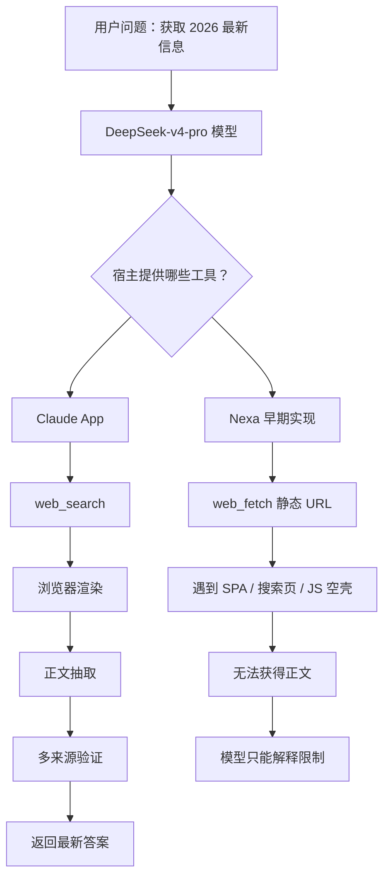
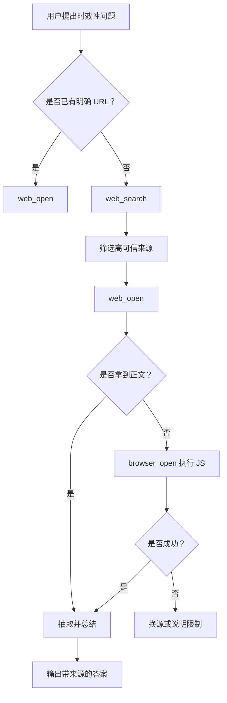

# 同模型下 Nexa 与 Claude 联网能力差异分析

> 状态说明：本文记录的是 Nexa 早期只有 `web_fetch` 时暴露的问题和设计分析。后续代码已经补充 `web_search`、`web_open`、`browser_open`、`web_research` 等工具；本文保留为问题复盘和工具设计依据。

## 背景

用户在 Nexa 中询问：

> 你为什么不能抓取 2026 年的信息？

Nexa 的回答大意是：

1. 模型训练数据截止较早，没有 2026 年之后的内置记忆。
2. 搜索引擎和中文内容站点访问受限。
3. 当前 `web_fetch` 工具只能抓取静态 HTML，无法执行 JavaScript，因此遇到 SPA 页面时只能拿到空壳。

同样的问题，在 Claude App 中却可以正确调用联网能力并抓取最新信息。底层模型都使用 DeepSeek-v4-pro，因此问题不在模型本身，而在 agent 宿主层提供的工具能力不同。

## 核心结论

同一个大模型放在不同 agent 产品中，表现可能完全不同。

大模型本身只是“大脑”，真正决定它能否获取实时信息的是宿主系统提供的“身体”和“工具”：

- 是否有搜索工具。
- 是否能打开网页。
- 是否能执行 JavaScript。
- 是否能抽取正文。
- 是否能跨来源检索和验证。
- 是否能把检索结果整理成模型可用的上下文。

因此，Claude App 能抓取 2026 年信息，并不说明 DeepSeek-v4-pro 自己拥有 2026 年知识，而是 Claude App 的宿主层提供了更完整的联网检索和网页阅读能力。

## Claude App 为什么能做到

Claude App 的联网能力通常包含以下宿主层能力：

1. 搜索能力

   可以根据用户问题主动搜索关键词，而不是要求模型先知道具体 URL。

2. 浏览能力

   可以打开搜索结果页面或目标网页。

3. JavaScript 渲染能力

   对于 SPA 页面，宿主可以加载页面、执行 JavaScript，再读取渲染后的 DOM 内容。

4. 正文抽取能力

   可以从复杂网页中提取标题、正文、发布时间、作者、摘要等，而不是把原始 HTML 直接交给模型。

5. 多来源检索策略

   遇到一个来源失败时，可以换搜索词、换搜索引擎、换来源，并对多个来源进行交叉验证。

6. 工具结果整理

   模型拿到的不是杂乱的 HTML，而是已经整理过、可读性较高的网页内容。

这些能力共同组成了 Claude App 的 web agent 能力。

## Nexa 早期的限制

Nexa 早期只注册了 `web_fetch` 工具，代码位置：

```text
src/main/agent-core/tools/web.ts
```

该工具的能力是：

```text
web_fetch(url)
```

它只能在已知 URL 的情况下，通过 `fetch` 获取目标地址返回的文本内容。

当时 `web_fetch` 的局限包括：

1. 不能主动搜索关键词

   用户问“2026 最新消息”时，Nexa 当时没有 `web_search` 工具，因此无法先搜索相关网页。

2. 不能解析搜索结果

   即使模型猜测搜索引擎 URL，返回内容也可能是页面框架、脚本或反爬页面。

3. 不能执行 JavaScript

   很多中文内容平台是 SPA，正文由前端 JS 动态加载。普通 `fetch` 只能拿到初始 HTML，无法获得渲染后的正文。

4. 不能自动抽正文

   当前工具不会使用 Readability、Cheerio、Turndown 等方式清洗页面内容。

5. 不能自动换源验证

   工具层没有封装“搜索多个来源、打开、抽取、去重、验证”的流程。

6. 无法处理反爬、登录墙、验证码、地理网络限制

   这些情况需要更复杂的浏览器环境、代理、用户授权或专门的数据源。

因此 Nexa 当时的联网能力更接近“静态 URL 抓取器”，不是完整的 web research agent。

## 为什么同样模型表现不同

可以把 agent 能力拆成三层：



同样是 DeepSeek-v4-pro：

- 在 Claude App 中，它可以调用完整联网工具，所以能回答最新信息。
- 在 Nexa 中，它只能调用静态 `web_fetch`，所以遇到动态网页和搜索需求时会失败。

这说明问题不在模型，而在 Nexa 的工具链。

## 当时 Nexa 的回答为什么合理

Nexa 回答“不能抓取 2026 年信息”，本质上是模型根据当前工具失败结果做出的解释。

它说的几个限制基本符合当前实现：

1. 训练数据截止

   模型自身不应该把训练数据之后的信息当成确定事实。

2. 搜索能力不足

   当前没有真正的 `web_search` 工具。

3. SPA 页面无法读取

   当前 `web_fetch` 不能执行 JS，因此很多现代网页确实只能拿到壳子。

不过，这个回答也暴露出一个产品问题：

Nexa 不应该让模型最终告诉用户“我做不到”，而应该在工具层补齐能力，让模型可以真的去搜索、打开、抽取和验证。

## 需要补齐的能力

为了让 Nexa 达到 Claude App 类似的联网效果，需要实现一套 web agent 工具链。

### 1. web_search

输入关键词，返回结构化搜索结果：

```json
{
  "query": "2026 AI news",
  "results": [
    {
      "title": "标题",
      "url": "https://example.com/article",
      "snippet": "摘要",
      "publishedAt": "2026-xx-xx",
      "source": "来源"
    }
  ]
}
```

可选实现方式：

- Bing Search API
- Brave Search API
- SerpAPI
- Tavily
- Exa
- 自建搜索代理

### 2. web_open

打开指定 URL，并返回可读正文。

它应该比当前 `web_fetch` 更强：

- 自动识别 HTML / JSON / text。
- 清洗正文。
- 返回标题、正文、发布时间、作者、站点名。
- 限制最大输出长度，避免污染上下文。

### 3. browser_open

使用 Playwright 或 Electron BrowserWindow 加载页面，执行 JavaScript 后再读取 DOM。

适合处理：

- SPA 页面。
- 搜索结果页。
- 需要等待网络请求完成的网页。
- 普通 `fetch` 拿不到正文的网页。

### 4. readability_extract

使用正文抽取算法清洗页面：

- Mozilla Readability
- Cheerio
- Turndown
- 自定义正文提取规则

输出 Markdown，便于模型阅读。

### 5. web_research

封装高阶检索流程：

1. 根据问题生成搜索词。
2. 搜索多个来源。
3. 打开候选网页。
4. 抽取正文。
5. 去重。
6. 交叉验证。
7. 返回带来源的摘要。

这类工具能显著减少 agent loop 的轮次，也能减少模型重复搜索和陷入循环的概率。

### 6. 系统提示调整

系统提示中需要明确：

- 遇到“今天、最新、实时、2026、新闻、价格、版本、政策、天气”等问题，必须优先调用联网工具。
- 不要仅凭训练数据回答时效性问题。
- 如果 `web_fetch` 失败，应尝试 `web_search`、`browser_open` 或换来源。
- 最终回答需要说明来源和时间。

## 建议的工具调用策略

对于时效性问题，Nexa 应按以下路径执行：



## 对产品体验的影响

补齐联网能力后，用户体验会发生明显变化：

当前体验：

```text
用户：2026 最新消息是什么？
Nexa：我训练数据截止，web_fetch 也抓不到，所以无法回答。
```

目标体验：

```text
用户：2026 最新消息是什么？
Nexa：正在搜索相关来源...
Nexa：已打开 5 个来源，2 个可用，1 个需要 JS 渲染...
Nexa：根据 A、B、C 来源，截至 2026-xx-xx，结论是...
```

这样 Nexa 才会从“会聊天的模型”变成“能联网执行任务的 agent”。

## 后续实现建议

优先级建议如下：

1. 实现 `web_search`

   先让 Nexa 能主动找到 URL。

2. 增强 `web_fetch` 为 `web_open`

   增加正文抽取、标题提取、Markdown 转换。

3. 增加 `browser_open`

   用 Playwright 或 Electron 执行 JavaScript，解决 SPA 页面。

4. 增加 `web_research`

   将搜索、打开、抽取、验证组合成高阶工具。

5. 优化系统提示

   让模型知道什么时候必须使用联网工具。

6. UI 展示来源

   在回复中展示引用来源、发布时间、访问时间。

## 总结

这次问题的本质不是 DeepSeek-v4-pro 不够强，而是 Nexa 当时没有提供完整联网工具链。

Claude App 能回答 2026 年信息，是因为它的宿主系统提供了搜索、浏览器渲染、正文抽取和多来源验证能力。

Nexa 当时只有静态 `web_fetch`，无法主动搜索，也无法处理大量 JavaScript 渲染页面，因此会在时效性问题上表现弱。

下一阶段应该重点建设 Nexa 的 web agent 能力，让模型不只是“知道自己不能”，而是能真正完成搜索、抓取、阅读和验证。
